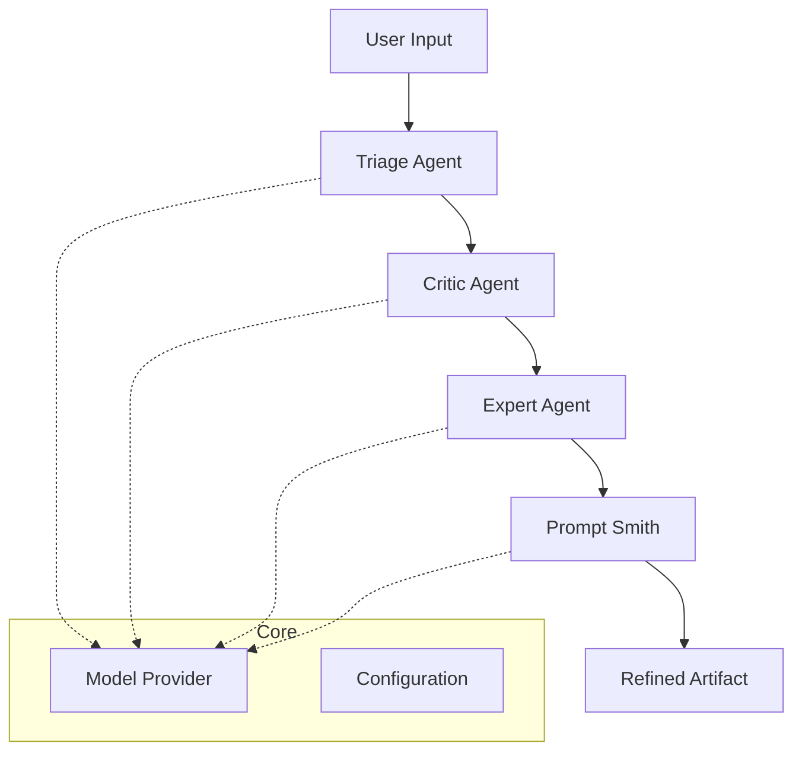


#  Promptify


> **Transform vague ideas into professional engineering specifications using AI agents.**

[](https://www.python.org/downloads/)
[](https://opensource.org/licenses/MIT)
[](https://github.com/psf/black)

---

##  Introduction

**Promptify** is an advanced AI-powered CLI tool designed to bridge the gap between abstract user intent and concrete technical requirements. It employs a multi-agent architecture (Triage, Critic, Expert, and Prompt Smith) to iteratively refine, critique, and enhance your prompts, delivering production-ready specifications for software projects.

No more back-and-forth. Just **Promptify** and build.

##  Features

*   ** Multi-Agent Architecture**: 
    *   **Triage Agent**: Understands intent and routes to the right expert.
    *   **Critic Agent**: Identifies gaps, ambiguities, and missing context.
    *   **Expert Agent**: Provides domain-specific architectural advice.
    *   **Prompt Smith**: Synthesizes everything into a perfect final prompt.
*   ** Dynamic Model Support**: Switch seamlessly between **Cerebras** (fast/free), **OpenAI** (GPT-4), **Anthropic** (Claude 3.5), or **Local LLMs**.
*   ** Interactive CLI & TUI**: Beautiful terminal user interface built with `Textual` and `Rich`.
*   ** Flexible Configuration**: Easy YAML-based configuration with environment variable support (`.env`).

##  Installation

1.  **Clone the repository**
    ```bash
    git clone https://github.com/yourusername/promptify.git
    cd promptify
    ```

2.  **Install dependencies**
    ```bash
    pip install .
    # Or manually
    pip install -r requirements.txt
    ```

3.  **Set up Environment**
    Create a `.env` file in the root directory:
    ```bash
    # For default (Cerebras)
    CEREBRAS_API_KEY=your_key_here
    
    # Optional
    OPENAI_API_KEY=sk-...
    ANTHROPIC_API_KEY=sk-...
    GOOGLE_GENAI_API_KEY=...
    ```

## Usage

### Quick Start
Run the interactive mode:
```bash
python cli.py refine "Build a flappy bird game in python"
```

### Command Line
Refine a prompt directly and save to file:
```bash
python cli.py refine "Create a CRM system for real estate" --output specs.md --format rich
```

### Configuration
Manage your LLM provider settings easily:

```bash
# View current config
python cli.py config --show

# Switch to OpenAI GPT-4
python cli.py config --provider openai --model gpt-4

# Switch to free Cerebras tier
python cli.py config --provider cerebras --model cerebras/llama3.1-8b
```

## Architecture



## Contributing

Contributions are welcome! Please examine the `agent/` directory for core logic and `core/providerSelection/` for model integration.

1.  Fork the Project
2.  Create your Feature Branch (`git checkout -b feature/AmazingFeature`)
3.  Commit your Changes (`git commit -m 'Add some AmazingFeature'`)
4.  Push to the Branch (`git push origin feature/AmazingFeature`)
5.  Open a Pull Request

## License

Distributed under the MIT License. See `LICENSE` for more information.

---
*Built with ❤️ by the Promptify Team*
