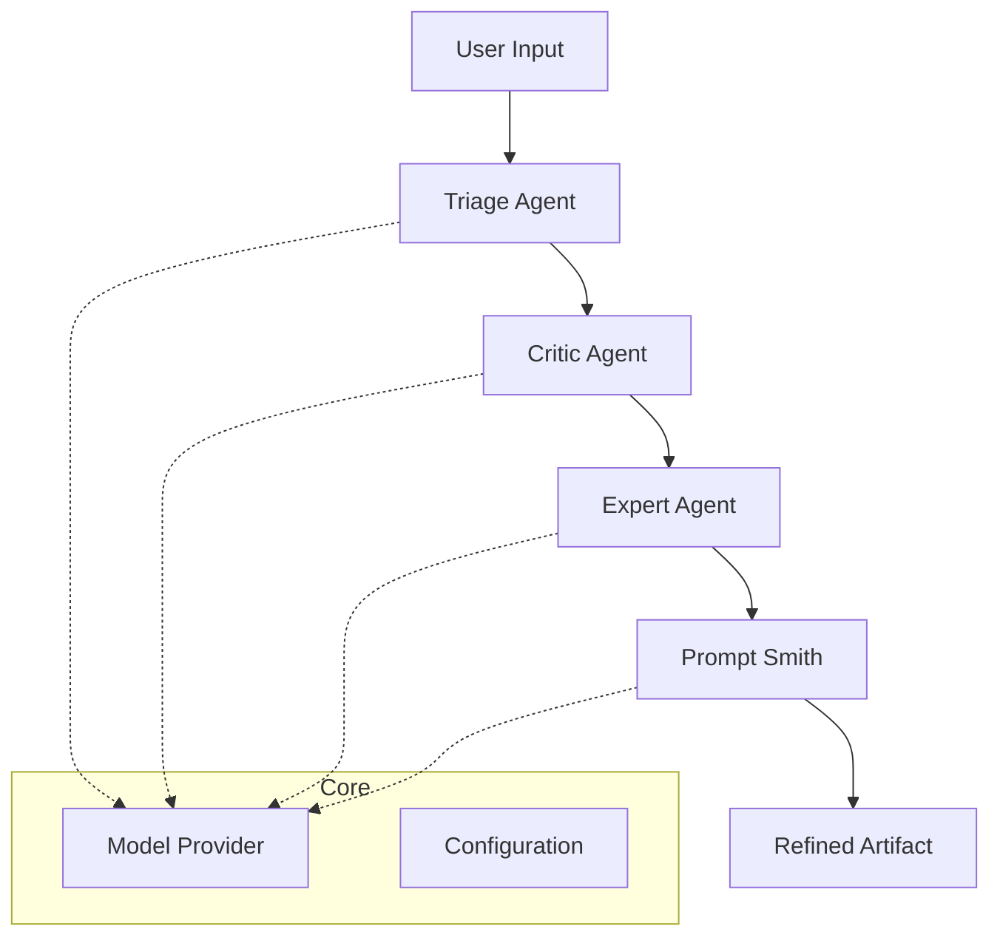


# Promptify


> **Transform vague ideas into professional engineering specifications using AI agents.**

[](https://badge.fury.io/py/pfy)
[](https://www.python.org/downloads/)
[](https://opensource.org/licenses/MIT)

---

## Introduction

**Promptify** is an advanced AI-powered CLI tool designed to bridge the gap between abstract user intent and concrete technical requirements. It employs a multi-agent architecture (Triage, Critic, Expert, and Prompt Smith) to iteratively refine, critique, and enhance your prompts, delivering production-ready specifications for software projects.

No more back-and-forth. Just **Promptify** and build.

## Features

*   **Multi-Agent Architecture**: 
    *   **Triage Agent**: Understands intent and routes to the right expert.
    *   **Critic Agent**: Identifies gaps, ambiguities, and missing context.
    *   **Expert Agent**: Provides domain-specific architectural advice.
    *   **Prompt Smith**: Synthesizes everything into a perfect final prompt.
*   **Dynamic Model Support**: Switch seamlessly between **Cerebras** (fast/free), **OpenAI** (GPT-4), **Anthropic** (Claude 3.5), or **Local LLMs**.
*   **Interactive CLI & TUI**: Beautiful terminal user interface built with `Textual` and `Rich`.
*   **Flexible Configuration**: Easy YAML-based configuration with environment variable support (`.env`).

## Installation

Install easily via PyPI:

```bash
pip install pfy
```

## Usage

### 1. Quick Start
Run the interactive mode to type your query and see the agents in action:

```bash
promptify refine
```
*Or with a direct query:*
```bash
promptify refine "Build a flappy bird game in python"
```

### 2. Configuration
Manage your LLM provider settings easily with the interactive TUI:

```bash
promptify config
```

Or via command line arguments:

```bash
# Switch to OpenAI GPT-4
promptify config --provider openai --model gpt-4

# Switch to free Cerebras tier (Default)
promptify config --provider cerebras --model cerebras/llama3.1-8b

# View current config
promptify config --show
```

### 3. Advanced Usage
Save the refined spec to a file or change format:

```bash
# Save to a markdown file
promptify refine "Create a CRM system" --output specs.md

# Output plain JSON for piping to other tools
promptify refine "Fix my regex" --format json
```

##  Setup API Keys
Promptify works best when you provide your own API keys. You can set them via the `promptify config` TUI or by setting environment variables in your shell (or a `.env` file).

```bash
export CEREBRAS_API_KEY=your_key_here
export OPENAI_API_KEY=sk-...
export ANTHROPIC_API_KEY=sk-...
```

##  Architecture



##  Contributing

Contributions are welcome! Please visit our [GitHub Repository](https://github.com/siva-netizen/Promptify) to report issues or submit PRs.

##  License

Distributed under the MIT License. See `LICENSE` for more information.

---
*Built with ❤️ by Siva Netizen*
