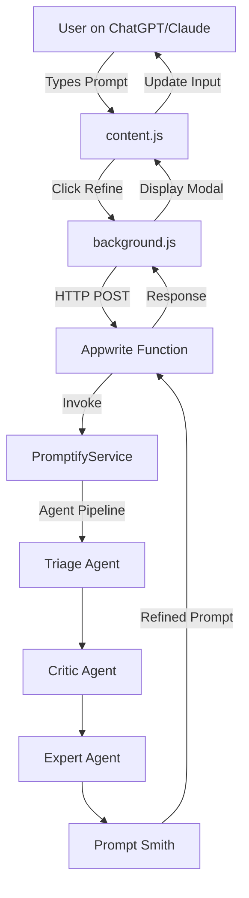

# Promptify Browser Extension

> Transform vague prompts into professional engineering specifications directly in ChatGPT, Claude, Gemini, and Perplexity.

[](https://microsoftedge.microsoft.com/addons/detail/njilmlgajbhikhbbbamfeoopidhjnkmd)

## Overview

The Promptify Browser Extension is a production-ready extension that integrates AI-powered prompt refinement into popular AI chat interfaces. It leverages a multi-agent architecture to iteratively transform simple user inputs into detailed, professional engineering specifications.

### Architecture

```
extension/
├── client/          # Browser extension source code (Manifest V3)
├── backend/         # FastAPI serverless function
├── tests/           # Playwright end-to-end tests
├── package.json     # Testing dependencies
└── playwright.config.js
```

The extension follows a **client-server architecture**:

1. **Client Extension** injects a "Refine" button into AI chat interfaces
2. User input is sent to the **Backend API** for processing
3. **Multi-Agent System** refines the prompt through 4 specialized agents
4. Refined output is returned and displayed in a confirmation modal

## Directory Structure

### `client/` - Browser Extension

The browser extension is built using **Manifest V3** and consists of:

- **`manifest.json`**: Extension configuration and permissions
- **`popup.html` / `popup.js` / `popup.css`**: Settings interface for API configuration
- **`background.js`**: Service worker handling message passing between extension components
- **`content.js`**: Core script that injects UI elements into supported platforms
- **`icons/`**: Extension icons for various sizes

#### Supported Platforms

The extension uses platform-specific selectors to inject the "Refine" button into:

- ChatGPT (`chatgpt.com`)
- Claude AI (`claude.ai`)
- Perplexity AI (`perplexity.ai`)
- Google Gemini (`gemini.google.com`)

### `backend/` - Serverless Backend

The backend is a **FastAPI** application designed for deployment to **Appwrite Functions** (serverless platform).

#### Key Components

- **`main.py`**: FastAPI application with dual entrypoints
  - Standard FastAPI endpoints (`/health`, `/refine`)
  - Appwrite Function handler (`main()` function)
- **`app_logging.py`**: Centralized logging configuration
- **`requirements.txt`**: Python dependencies including `promptify` core library
- **`Dockerfile`**: Container configuration for cloud deployment
- **`pyproject.toml`**: Python project metadata for `uv` package manager

#### API Endpoints

**Base URL**: `https://6948346f001194e559d2.nyc.appwrite.run`

**POST `/refine`**
- **Request Body**:
  ```json
  {
    "prompt": "build a snake game",
    "model_provider": "cerebras",
    "model_name": "llama-3.3-70b",
    "api_key": "optional_user_key"
  }
  ```
- **Response**:
  ```json
  {
    "refined_prompt": "...",
    "original_prompt": "build a snake game"
  }
  ```

**GET `/health`**
- Returns service status

See [`backend/API.md`](./backend/API.md) for complete API documentation.

## Installation

### For End Users

Install directly from the Microsoft Edge Add-ons Store:

**[Install Promptify Extension](https://microsoftedge.microsoft.com/addons/detail/njilmlgajbhikhbbbamfeoopidhjnkmd)**

### For Developers

#### 1. Load Extension Locally

```bash
# Navigate to Edge extensions page
edge://extensions/

# Enable "Developer mode"
# Click "Load unpacked"
# Select the extension/client directory
```

#### 2. Configure Backend

The extension connects to a cloud-hosted backend by default. To use a local backend:

```bash
cd backend
pip install -r requirements.txt
uvicorn main:app --reload
```

Then update the API URL in the extension popup settings to `http://localhost:8000`.

## Usage

1. **Configure API Key**: Click the extension icon and enter your API key for your preferred model provider (Cerebras, OpenAI, Gemini, or Anthropic)
2. **Visit Supported Platform**: Navigate to ChatGPT, Claude, Gemini, or Perplexity
3. **Type Your Prompt**: Enter a simple prompt in the chat input
4. **Click Refine**: A purple "Refine" button will appear below the input
5. **Review & Confirm**: A modal will show the refined prompt. Click "Update Input" to replace your original text

## Backend Services

### Multi-Agent System

The backend leverages the [Promptify Core Library](../../cli) which implements a **4-agent orchestration pipeline**:

1. **Triage Agent**: Analyzes user intent and determines the optimal expert
2. **Critic Agent**: Identifies gaps, ambiguities, and missing context
3. **Expert Agent**: Provides domain-specific architectural recommendations
4. **Prompt Smith**: Synthesizes all feedback into a final, production-ready specification

### Model Provider Support

The backend supports multiple LLM providers:

- **Cerebras**: Ultra-fast inference (default)
- **OpenAI**: GPT-4 and GPT-4 Turbo
- **Google Gemini**: Gemini Pro models
- **Anthropic**: Claude 3.5 Sonnet

Users can configure their preferred provider and model in the extension settings.

### Deployment

The backend is deployed to **Appwrite Functions** using a **GitHub Actions** CI/CD pipeline. The `main()` function serves as the Appwrite entrypoint, while the FastAPI app can also run standalone.

## Development

### Running Tests

```bash
cd extension
npm install
npx playwright install chromium
npx playwright test
```

### Building Release Package

```bash
cd extension
Compress-Archive -Path client\* -DestinationPath promptify-v{VERSION}.zip
```

## Architecture Diagram



## License

MIT License. See the main repository for details.

## Links

- **Extension Store**: [Microsoft Edge Add-ons](https://microsoftedge.microsoft.com/addons/detail/njilmlgajbhikhbbbamfeoopidhjnkmd)
- **API Documentation**: [`backend/API.md`](./backend/API.md)
- **Main Repository**: [Promptify on GitHub](https://github.com/siva-netizen/Promptify)
- **CLI Package**: [PyPI - pfy](https://pypi.org/project/pfy/)
